> This project is developed for educational and experimental purposes only. Its primary goal is to try out modern Android development technologies and approaches that help create better apps.

Browse, search, download, and share amazing free photos provided by talented photographers on [Pexels](https://www.pexels.com), [Unsplash](https://unsplash.com), and [Pixabay](https://pixabay.com).

- Discover new photos every day
- Search for any topic
- Get personal recommendations
- Add any photo to your Favorites list
- Download and share
- Set any photo as your device wallpaper

## Technologies
- [Jetpack Compose](https://developer.android.com/jetpack/compose)
- [Android Architecture Components](https://developer.android.com/topic/libraries/architecture)
- [Hilt](https://developer.android.com/training/dependency-injection/hilt-android)
- [Navigation Component](https://developer.android.com/guide/navigation)
- [Paging 3](https://developer.android.com/topic/libraries/architecture/paging/v3-overview)
- [Room](https://developer.android.com/topic/libraries/architecture/room)
- [Retrofit](https://square.github.io/retrofit)
- [Kotlin Coroutines](https://kotlinlang.org/docs/reference/coroutines-overview.html)
- [Kotlin Flows](https://developer.android.com/kotlin/flow)
- [Cloud Firestore](https://firebase.google.com/docs/firestore)
- [Firebase Remote Config](https://firebase.google.com/docs/remote-config)
- [ML Kit](https://developers.google.com/ml-kit)
- [Glide](https://github.com/bumptech/glide)
- [Chrome Custom Tabs](https://developer.chrome.com/multidevice/android/customtabs)
- [Macrobenchmark](https://developer.android.com/topic/performance/benchmarking/benchmarking-overview)

## Screenshots

  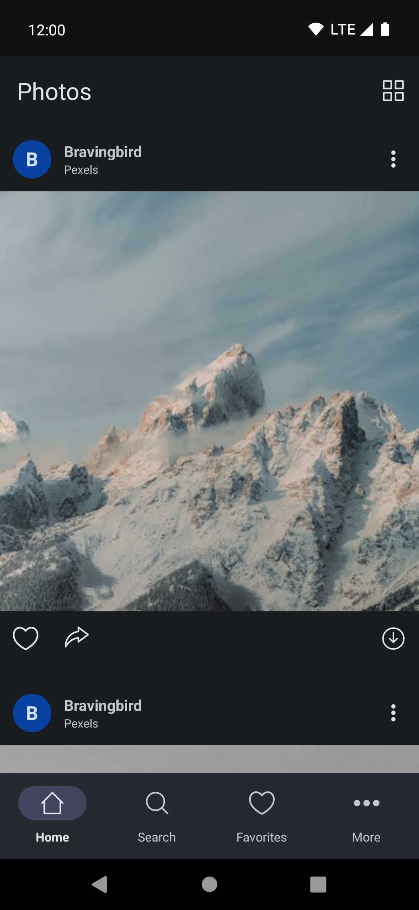
  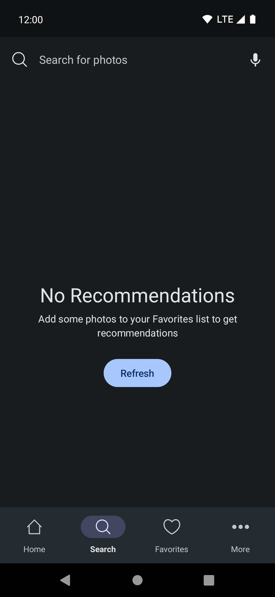
  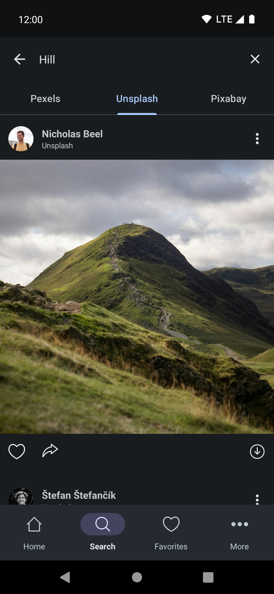
  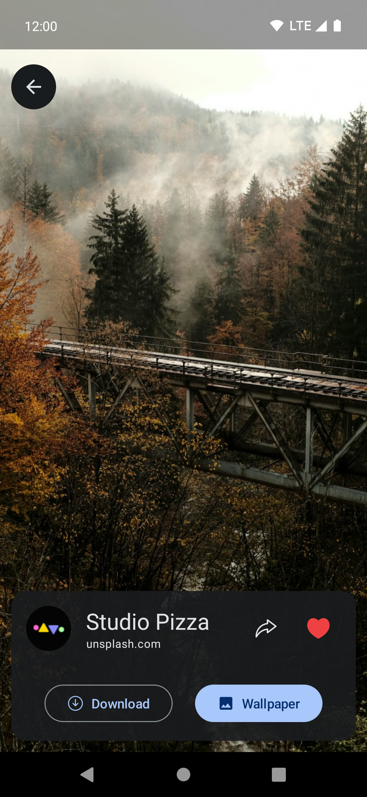
  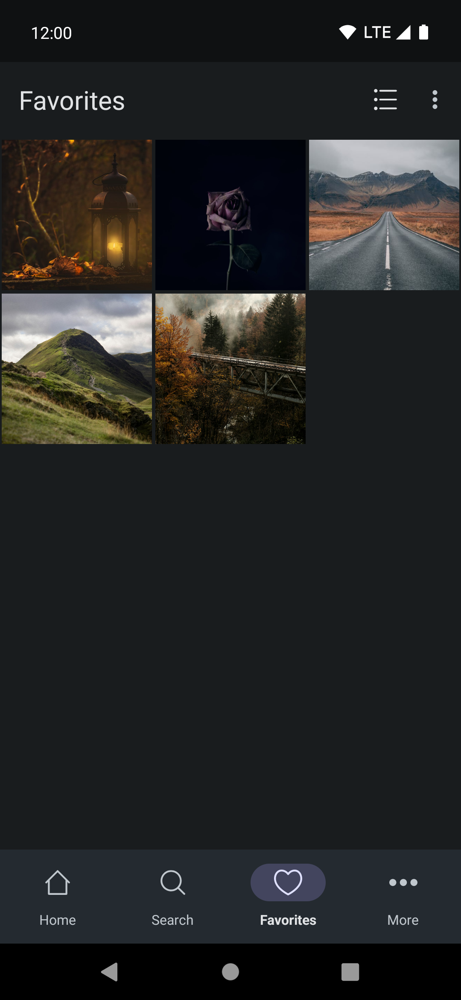
  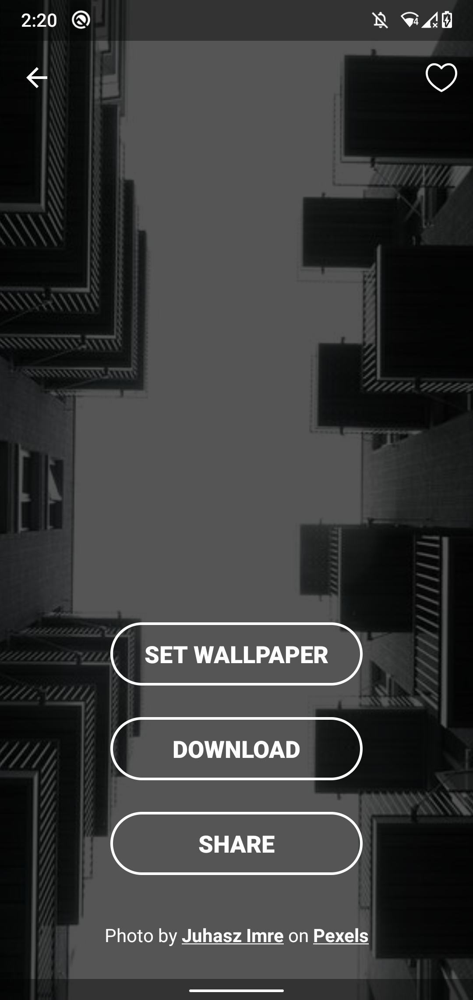
  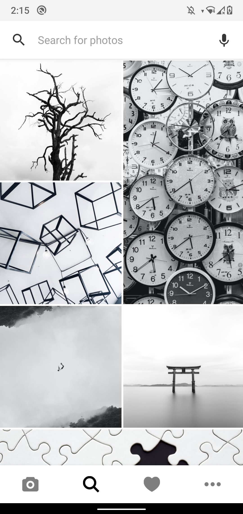
  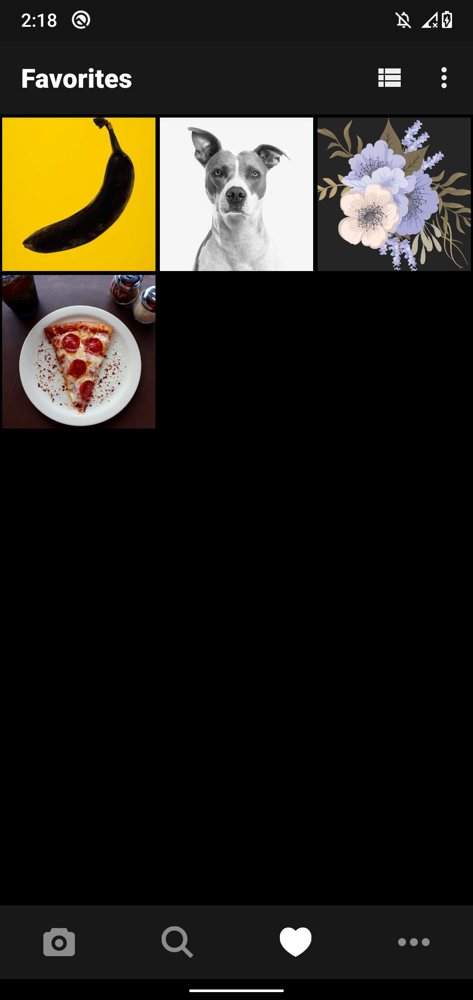
  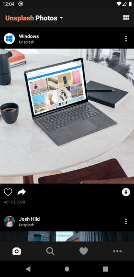
  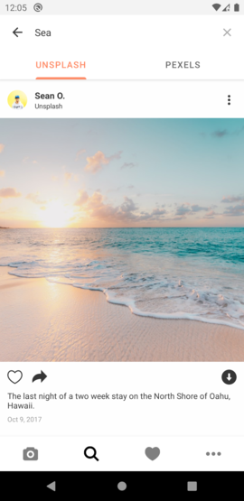
  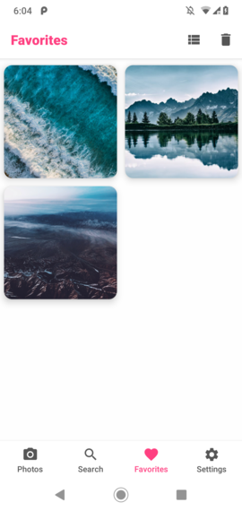
  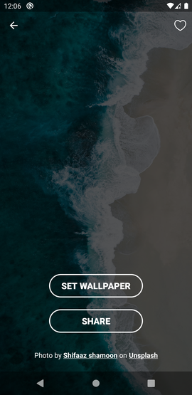
  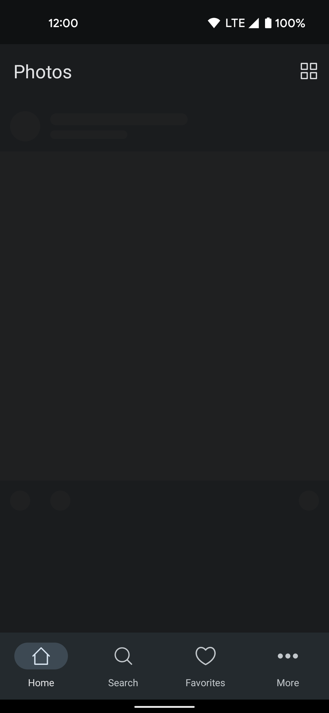
  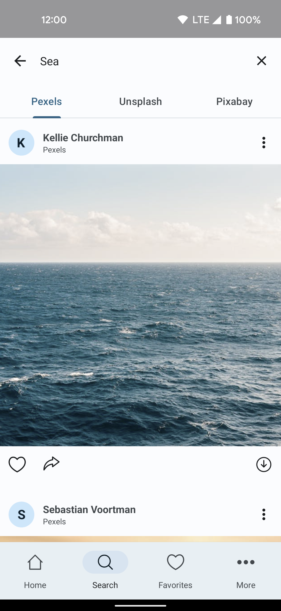
  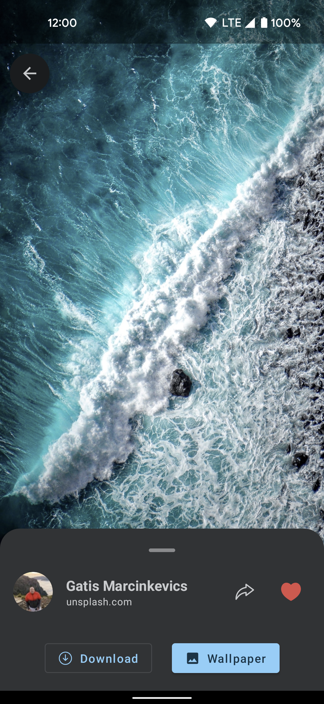
  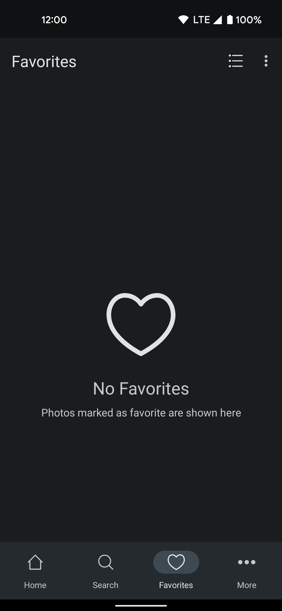
  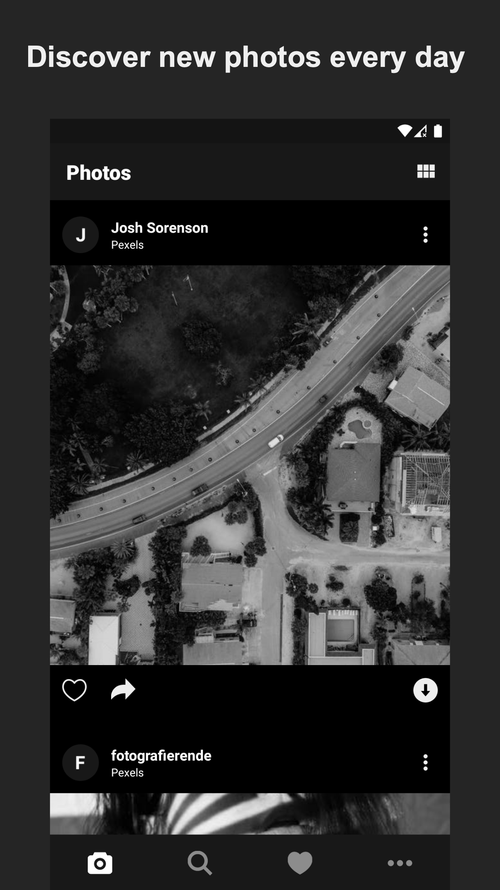
  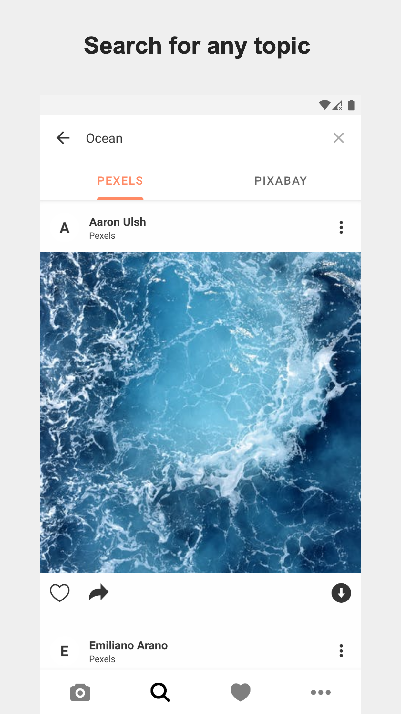
  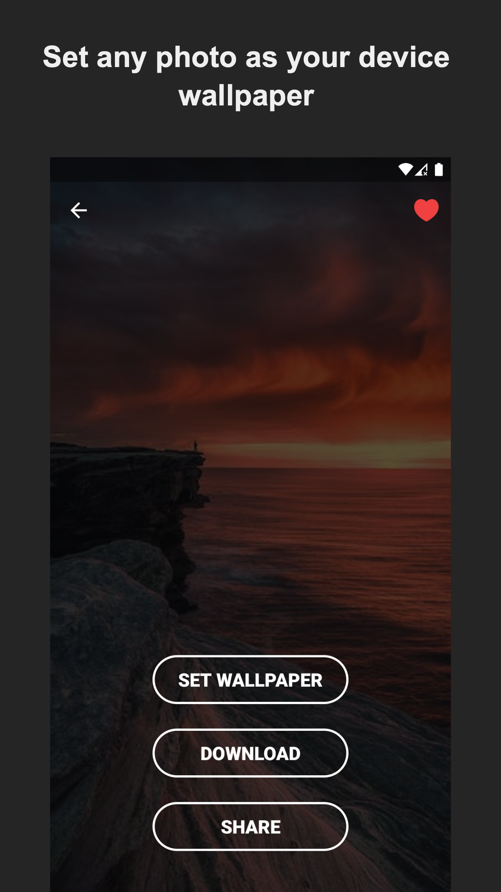
  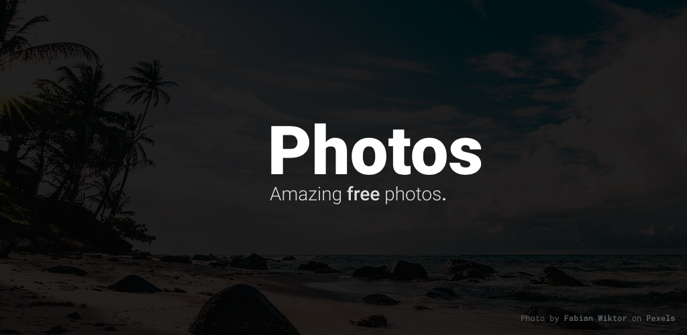

